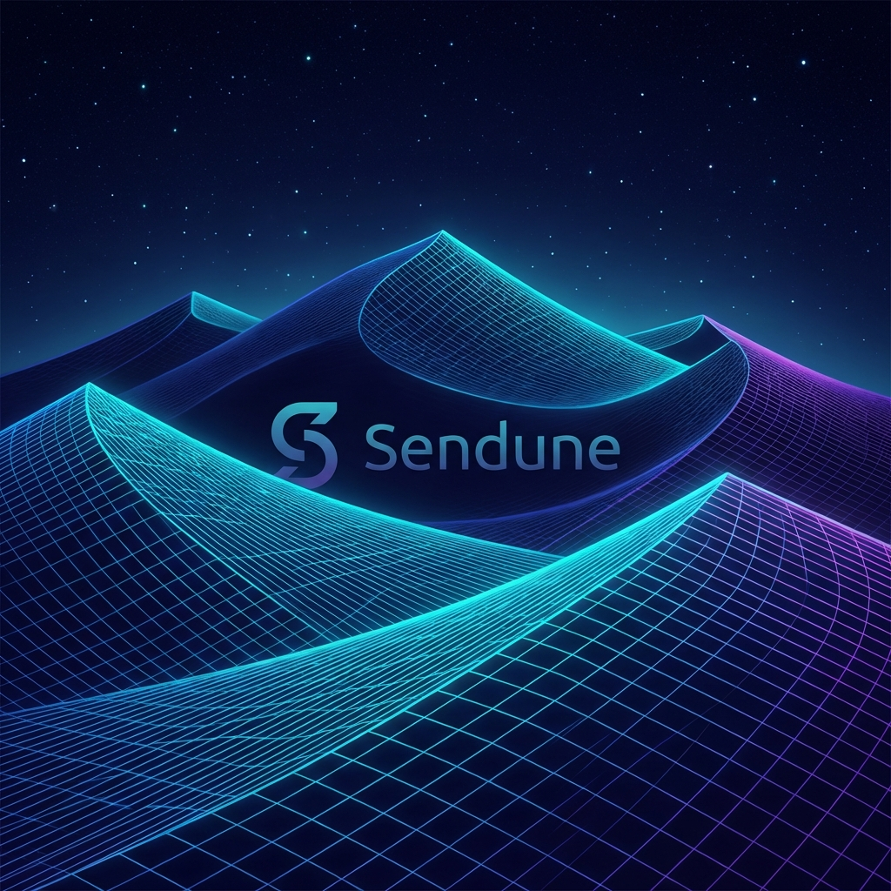

# 🌐 SENDUNE Linux

**A Modern Arch-Based Linux Distribution**

[](https://python.org)
[](https://archlinux.org)
[](https://www.gnu.org/licenses/gpl-3.0)

SENDUNE Linux is a modern, user-friendly Linux distribution based on Arch Linux. It provides an easy-to-use installer with comprehensive software selection and system configuration options for both beginners and advanced users.



## ✨ Features

- 🚀 **Easy Installation** - Guided installer with intelligent defaults and animated UI
- 📦 **Comprehensive Software** - Extensive package selection for all use cases
- 🎮 **Gaming Optimized** - Steam integration and gaming performance tuning
- 💻 **Developer Focused** - Complete development stacks for every programming language
- 🔒 **Security First** - Built-in security features and automated hardening
- 🎨 **Beautiful UI** - Hyprland desktop with custom themes and wallpapers

---

## 🏗️ Building the ISO

### Quick Start

```bash
# Build with default settings (outputs to ./out-iso/SENDUNE.iso)
./build_arch_iso.sh SENDUNE_installer

# Build with custom output path
./build_arch_iso.sh SENDUNE_installer -o ~/Downloads/my-sendune.iso

# Build with custom ISO name
./build_arch_iso.sh SENDUNE_installer -n MyDistro -o ./builds/mydistro.iso

# Clean build (re-download releng profile)
./build_arch_iso.sh SENDUNE_installer --clean

# Verbose output
./build_arch_iso.sh SENDUNE_installer -v
```

### Build Options

| Option | Description |
|--------|-------------|
| `-o, --output FILE` | Output ISO file path (default: `./out-iso/SENDUNE.iso`) |
| `-n, --name NAME` | ISO name/label (default: `SENDUNE`) |
| `-c, --clean` | Clean build - removes existing releng profile |
| `-v, --verbose` | Verbose mkarchiso output |
| `-h, --help` | Show help message |

### Requirements

- **Native Arch Linux**: Uses `archiso` directly
- **WSL/Other**: Automatically uses Docker for building
- **Docker**: Required on non-Arch systems

### Output

The ISO is built to `./out-iso/SENDUNE.iso` by default. This includes:
- Auto-login as root
- Auto-launch of SENDUNE installer on boot
- Custom splash screen
- Minimal packages (~200MB ISO)

---

## 🖥️ Running the Installer

### On Live ISO

The installer starts automatically when you boot the ISO. You can also run:

```bash
sendune              # Global command
# or
python3 -m SENDUNE_installer
```

### Development/Testing (Mock Mode)

On Windows or non-Arch systems, the installer runs in **Mock Mode** - no actual system changes are made:

```powershell
python -m SENDUNE_installer
```

---

## 🎨 Desktop Environments

| Desktop | Description |
|---------|-------------|
| **Hyprland** | Modern Wayland compositor with animations |
| **GNOME** | Full-featured desktop environment |
| **KDE Plasma** | Feature-rich and customizable |
| **XFCE** | Lightweight and traditional |
| **i3** | Tiling window manager |
| **Awesome WM** | Lua-based window manager |
| **Cinnamon/MATE/LXQt** | Classic desktop experiences |

---

## 🛠️ Installation Features

### Core Features
- 🖥️ Desktop environments (9 options)
- 🎮 Graphics drivers (NVIDIA, AMD, Intel, VirtualBox, VMware)
- 👤 User account creation with sudo access
- 🌐 Network configuration (WiFi, Ethernet)
- 🔧 Bootloader installation (GRUB, systemd-boot)

### Development Tools
- **Languages**: Python, JavaScript, Java, C/C++, Ruby, PHP, Go, Rust
- **Tools**: Git, Docker, VS Code, Vim, Neovim
- **Databases**: PostgreSQL, MySQL, MongoDB, Redis, SQLite
- **Containers**: Docker, Podman, Docker Compose

### Security Features
- 🔥 Firewall (UFW)
- 🛡️ AppArmor / SELinux
- 🚫 Fail2Ban intrusion prevention
- 🦠 ClamAV antivirus
- 🔐 Audit framework

### System Utilities
- Archive tools, file managers, terminal emulators
- System monitors, disk tools, network tools
- Power management, Bluetooth tools

### Multimedia
- Audio/video codecs
- Media players (VLC, MPV)
- Creative software (GIMP, Blender, Audacity, OBS)

---

## 📦 Package Management with Flip

SENDUNE includes `flip` - a user-friendly package manager wrapper:

```bash
flip install <package>   # Install packages
flip yeet <package>      # Remove packages
flip update              # Update system
flip search <query>      # Search packages
flip info <package>      # Package information
flip list                # List installed packages
flip autoremove          # Remove orphaned packages
flip clean               # Clean cache
flip help                # Show help
```

### AUR Support

`yay` is pre-installed for AUR packages:

```bash
yay -S <package>    # Install from AUR
yay -Syu            # Update all including AUR
yay -Ss <query>     # Search AUR
```

---

## 🤖 AI-Powered Features

SENDUNE includes an AI Installation Assistant that recommends configurations based on your use case:

| Profile | Best For |
|---------|----------|
| 🎮 Gaming PC | Steam, Lutris, Proton, performance tuning |
| 💻 Developer Workstation | IDEs, containers, databases |
| 🎨 Creative Studio | GIMP, Blender, Kdenlive, audio production |
| 📊 Office/Productivity | LibreOffice, browsers, cloud storage |
| 📺 Media Center | Kodi, Plex, streaming apps |
| 🖥️ Server/NAS | Docker, Nginx, databases, SSH |
| 🔒 Privacy-Focused | Tor, VPN, encryption tools |
| 📚 Educational | Jupyter, R, scientific tools |

---

## 📊 Configuration Scoring

After installation, SENDUNE provides a configuration score:

| Category | Max Points |
|----------|------------|
| Desktop Environment | 15 |
| Graphics Drivers | 15 |
| Development Tools | 15 |
| Security Features | 15 |
| System Utilities | 10 |
| Network Services | 10 |
| Multimedia Support | 10 |
| Office/Productivity | 10 |

**Grades**: A+ (90+), A (80+), B (70+), C (60+), D (<60)

---

## 🚀 Quick Installation Steps

1. **Build the ISO**:
   ```bash
   ./build_arch_iso.sh SENDUNE_installer
   ```

2. **Boot the ISO** (the installer starts automatically)

3. **Follow the prompts**:
   - Choose desktop environment
   - Select graphics drivers
   - Configure partitions
   - Add users
   - Select additional software

4. **Reboot** and enjoy SENDUNE Linux!

---

## 📁 Project Structure

```
SENDUNE-ARCHINSTALLER/
├── build_arch_iso.sh          # ISO builder script
├── SENDUNE_installer/         # Python installer module
│   ├── __main__.py            # Entry point
│   ├── full_installation.py   # Main installation flow
│   ├── installer_functions.py # Interactive functions
│   ├── custom_classes.py      # Helper classes
│   ├── narchs_logos.py        # Animated logo
│   ├── dotfiles.py            # Configuration files
│   └── assets/                # Wallpapers, icons
├── out-iso/                   # Built ISO output (default)
├── iso_work/                  # Build working directory
└── README.md
```

---

## 🔧 Testing the ISO

After building, test with QEMU:

```bash
qemu-system-x86_64 -cdrom out-iso/SENDUNE.iso -m 2G -enable-kvm
```

Or write to USB:

```bash
sudo dd if=out-iso/SENDUNE.iso of=/dev/sdX bs=4M status=progress
```

---

## 🤝 Contributing

Contributions are welcome! Please feel free to submit issues and pull requests.

---

## 📄 License

This project is licensed under the GPL v3 License - see the [LICENSE](LICENSE) file for details.

---

**Built with ❤️ by the SENDUNE Linux team**